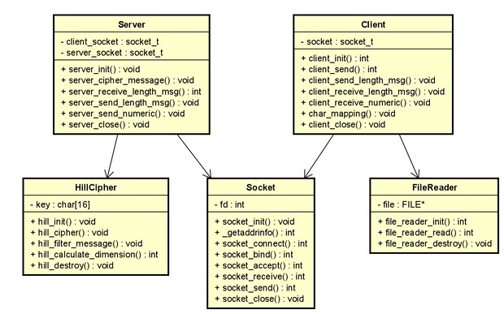

# Taller de Programación - Cátedra Veiga - FIUBA
# Trabajo Práctico I

<h2 align="right">Juan Bautista Xifro</h2>
<h2 align="right">101717</h2>

## Introducción
En este primer trabajo práctico se busca nivelarnos a nosotros, los alumnos, en el lenguaje de programación C y en varias varias buenas practicas de programación en general. Para esto se nos pide programar usando TDA y se nos introduce a la programación de redes.

######Nota
**El softwar utilizado para crear los modelos fue Astah, si bien los trata como si fueran clases en C estas no existen.**

##Diseño
Este proyecto presenta varios archivos distintos donde se representan por ```server_``` estos son los archivos que utiliza el servidor, lo mismo ocurre con ```client_``` para los archivos que utiliza el cliente y ```common_``` para aquellos que usan ambos, la ultima distinción es ```_main``` para aquellos donde se llaman a todas la otras funciones y verifican sus outputs.

En mi caso ```server_hill_cipher``` es el encargado de cifrar el mensaje al recibirlo por parámetro y devolver un vector de enteros con el valor especificado. Luego en para el cliente ```client_file_reader```
el cual se encarga de abrir, leer y cerrar el archivo pasado para obtener el mensaje a enviar por el cliente y por ultimo ```common_socket``` el cual es el encargado de abrir, recibir, mandar, conectar, bindear y cerrar los sockets para que cliente y servidor puedan comunicarse.

<br><p align="center"></p>

##Secuencia del programa
###Cliente a Servidor
Primero veremos la secuencia del programa cuando el ```client_main``` envía un mensaje al servidor para que este sea cifrado.


<br><p align="center"></p>

Comienza por crear ```Client``` el cual se encarga de crear a ```Socket``` para conectarse con este al servidor, también el Cliente recibe el **filename** para luego crear el ```file_reader``` el cual le retornara el mensaje leído y mediante un loop en el cual se va a llevar la conversación entre él y el servidor hasta que no tenga mas mensajes para enviar. Cuando este termina cierra ```Socket y file_reader``` si todo sale correctamente retorna 0 a ```Client_main``` y por ultimo este cierra ```Client```.

###Servidor a Cliente
A continuación se vera el diagrama de secuencia de lo que ocurre en ```Server_main``` cuando se recibe un mensaje para cifrar.


<br><p align="center"></p>


Símil al cliente comienza por crear a ```Server``` el cual crea dos ```Socket``` uno para *bindear* el servidor y otro para la comunicación con el cliente el cual lo deja en un estado de *accept* hasta que el cliente se conecte al puerto donde se encuentra el servidor. Luego el ```Server``` mediante la funcion **server_cipher_message()** crea a ```Hill_cipher``` y comienza el *loop* para la conversación con el cliente. Dentro de esta ```Server``` le envía a ```Hill_cipher``` el mensaje a cifrar y un vector de enteros a ser inicializado donde irán los enteros del cifrado. Cuando el cliente no envía mas mensajes y cierra su conversación el *loop* termina y ```Server``` cierra ```Hill_cipher``` y su socket. Por ultimo ```Server_main``` cierra ```Server```.

##Conclusión
Este tp, en lo personal, me pareció bastante complicado, tuve que dedicarle mucho tiempo, mucha búsqueda en google y repasos de las clases.
Si bien me costo mucho entender como programar correctamente la conversación entre cliente y servidor, realmente siento que aprendí al menos lo básico respecto de este tema. Como también me sirvió para refrescar los temas como manejo de archivos y TDA.
Dicho esto también me sirvió muchísimo para aprender varias herramientas como valgrind, gdb o makefile. Que sin estas hubiese sido realmente complicado debuguear este tp.

